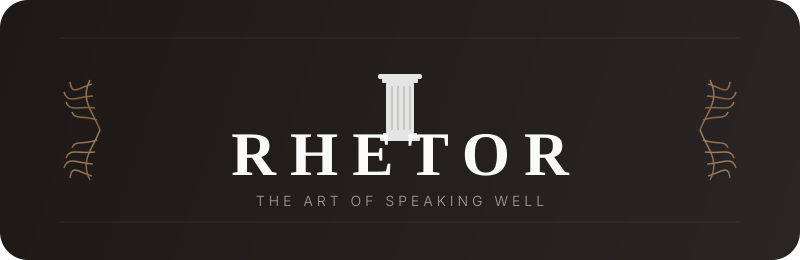

<div align="center">

<picture>
  <source media="(prefers-color-scheme: dark)" srcset="public/logo.svg">
  <source media="(prefers-color-scheme: light)" srcset="public/logo.svg">
  
</picture>

<br>

[](https://react.dev)
[](https://www.typescriptlang.org)
[](https://vite.dev)
[](LICENSE)

</div>

---

## What is Rhetor?

**Rhetor** is an AI-powered public speaking and pitch coaching app rooted in classical Greek rhetoric. Your personal AI coach — **Zeus** — guides you through real-time voice practice, audience simulations, and structured lessons across the five pillars of rhetoric: **Ethos, Logos, Pathos, Kairos, and Lexis**.

The app uses **Gemini 2.5 Flash** with native audio (Live API) for real-time voice interaction — Zeus listens to you speak, provides live coaching feedback, and can control the entire UI through function-calling tools. A built-in gamification system with **Drachmas (Δ)**, daily streaks, and unlockable achievements keeps you motivated on your journey from nervous speaker to commanding orator.

---

## ✨ Features

| Feature | Description |
|---|---|
| 🎙️ **Live Practice** | Teleprompter with auto-advance, real-time WPM tracking, filler word counter, posture overlay, and slide preview — all with live AI coaching |
| 🎭 **Audience Simulation** | Roleplay against AI personas — Skeptical Investor, Angry Customer, Confused Novice — to pressure-test your pitch |
| 🧘 **Warm-Up Routine** | 3-stage pre-practice: box breathing (animated), voice exercises with pitch detection, and posture checks via camera + MoveNet |
| 🗡️ **Kill Fillers Game** | 30-second challenge — answer random questions without filler words; real-time detection and scoring |
| 🏛️ **Agora (Learning Path)** | Structured lessons organized by the 5 rhetoric pillars, each with explain → demonstrate → practice → quiz steps |
| 📊 **Performance Review** | Post-session dashboard: duration accuracy, WPM, filler count, talking-point coverage, posture & eye-contact scores |
| 📑 **Deck Support** | Upload PDF, PPTX, or images — slides are displayed alongside the teleprompter during practice |
| ✍️ **Pitch Prep** | AI-guided interview where Zeus asks questions to extract and structure your talking points |
| 📝 **Templates** | Pre-built frameworks for Elevator Pitch (60s), Investor Pitch (3min), Interview (2min), and more |
| 🏆 **Gamification** | Earn Drachmas, maintain streaks, unlock achievements and badges, and celebrate with confetti & coin animations |

---

## 🏗️ Architecture

```
┌─────────────────────────────────────────────────────────────┐
│                         App.tsx                             │
│   ErrorBoundary → RhetorProvider → AppContent               │
│   (view routing via useState + FadeTransition)              │
└──────────────────────────┬──────────────────────────────────┘
                           │
          ┌────────────────┼────────────────┐
          │                │                │
     Views/Components   Hooks/Context     Store
          │                │                │
  ViewHome.tsx        useRhetor.ts    useRhetorStore.ts
  ViewPractice.tsx    (main hook —    (Zustand, 6 slices)
  ViewSimulation.tsx   wires AI,     ┌───────────────┐
  ViewWarmUp.tsx       detectors,    │ • Gamification │
  ViewLearn.tsx        audio,        │ • Progress     │
  ViewKillFillers.tsx  & store)      │ • Session      │
  ViewReview.tsx           │         │ • AI           │
  BottomNav.tsx            │         │ • Pitch        │
  AIStatusOrb.tsx          │         │ • UI           │
  AppOverlays.tsx          │         └───────────────┘
                           │
            ┌──────────────┼──────────────┐
            │              │              │
      AI / Gemini     Detectors      Audio Pipeline
            │              │              │
  gemini_client.ts  filler_detector    audio_recorder.ts
  (Live API,        posture_detector   audio_streamer.ts
   auto-reconnect,  (TF.js MoveNet)   audio_utils.ts
   msg queue,       pitch_detector     worklets/
   heartbeat)       (autocorrelation)  (AudioWorklet)
            │       breathing_detector
  tool_handler.ts   pose_verifier.ts
  (dispatches AI
   function calls
   → store actions)
            │
  prompts.ts ─── tools.ts
  (system         (17+ function
   instructions)   declarations)
```

**Key patterns:**

- **No router** — view management is a simple `useState<View>` in `App.tsx` with `FadeTransition` wrappers
- **`useRhetor`** is the central integration hook — it wires the Gemini Live client, tool handler, filler detector, audio pipeline, and Zustand store together
- **AI tool-use** — Zeus can call 17+ tools to navigate views, award drachmas, trigger celebrations, start timers, advance the teleprompter, save pitches, and more
- **Gemini client** features automatic reconnection with exponential backoff, a message queue, heartbeat/ping, and stale connection detection
- **Zustand store** uses `persist` middleware for local storage and is organized into 6 feature slices

---

## 🛠️ Tech Stack

| Layer | Technology |
|---|---|
| **Framework** | React 19 + TypeScript 5.8 |
| **Build** | Vite 6 |
| **State** | Zustand 5 (persist + immer middleware) |
| **AI / LLM** | Google Gemini 2.5 Flash Native Audio — `@google/genai` Live API |
| **Animations** | Framer Motion 10 |
| **Posture Detection** | TensorFlow.js + MoveNet |
| **Body Tracking** | MediaPipe Tasks Vision |
| **Pitch Detection** | Custom autocorrelation (Web Audio API) |
| **Breathing Detection** | Microphone volume/rhythm analysis |
| **Filler Detection** | Real-time regex scanner on transcripts |
| **Deck Parsing** | `@jvmr/pptx-to-html` + JSZip (PPTX) / PDF / images |
| **Icons** | Lucide React |
| **Styling** | Tailwind CSS + Google Fonts (Cormorant Garamond & Inter) |
| **Audio** | Web Audio API with custom AudioWorklet pipeline |
| **Package Manager** | pnpm |

---

## 🚀 Getting Started

### Prerequisites

- **Node.js** ≥ 18
- **pnpm** (`npm install -g pnpm`)
- A **Google Gemini API key** ([get one here](https://aistudio.google.com/apikey))

### Setup

```bash
# 1. Clone the repo
git clone https://github.com/LachPawel/Rhetor.git
cd Rhetor

# 2. Install dependencies
pnpm install

# 3. Set your API key
echo "GEMINI_API_KEY=your_key_here" > .env.local

# 4. Start the dev server
pnpm dev
```

The app will be available at **http://localhost:3000**.

### Browser Permissions

Rhetor requires **camera** (posture detection) and **microphone** (voice coaching, pitch detection, breathing analysis) access. Grant permissions when prompted.

### Available Scripts

| Command | Description |
|---|---|
| `pnpm dev` | Start dev server (port 3000) |
| `pnpm build` | Production build |
| `pnpm preview` | Preview production build |
| `pnpm typecheck` | Run TypeScript type-checking |

---

## 📁 Project Structure

```
Rhetor/
├── App.tsx                  # Root component — view routing & providers
├── constants.ts             # App-wide constants & config
├── types.ts                 # Shared TypeScript types & enums
├── index.html               # Entry HTML
├── components/              # All view & UI components
│   ├── ViewHome.tsx         # Main dashboard
│   ├── ViewPractice.tsx     # Live pitch practice
│   ├── ViewSimulation.tsx   # Audience simulation
│   ├── ViewWarmUp.tsx       # Warm-up routine
│   ├── ViewLearn.tsx        # Agora learning path
│   ├── ViewKillFillers.tsx  # Filler word game
│   ├── ViewReview.tsx       # Performance review
│   ├── AIStatusOrb.tsx      # AI connection status indicator
│   ├── AppOverlays.tsx      # Celebrations, toasts, achievements
│   └── ...
├── lib/                     # Core logic & integrations
│   ├── useRhetor.ts         # Main hook — wires everything together
│   ├── gemini_client.ts     # Gemini Live API client
│   ├── tool_handler.ts      # AI function-call dispatcher
│   ├── prompts.ts           # System instructions & mode contexts
│   ├── tools.ts             # Gemini tool declarations
│   ├── filler_detector.ts   # Real-time filler word detection
│   ├── posture_detector.ts  # TF.js MoveNet posture analysis
│   ├── pitch_detector.ts    # Voice pitch analysis
│   ├── breathing_detector.ts# Breathing rhythm detection
│   ├── audio_recorder.ts    # Audio recording pipeline
│   ├── audio_streamer.ts    # Audio streaming to Gemini
│   └── ...
├── stores/
│   └── useRhetorStore.ts    # Zustand store (6 slices)
├── contexts/
│   └── RhetorContext.tsx     # React Context compatibility bridge
└── src/
    ├── data/
    │   ├── lessons.ts       # Lesson catalogue (5 rhetoric pillars)
    │   └── templates.ts     # Pitch templates
    └── lib/
        └── teleprompter_matcher.ts  # Fuzzy keyword matching
```

---

## 🎓 The Five Pillars

Rhetor's curriculum is built around the classical pillars of Greek rhetoric:

| Pillar | Focus |
|---|---|
| 🏛️ **Ethos** | Credibility & character — build trust with your audience |
| 🧠 **Logos** | Logic & structure — craft clear, compelling arguments |
| ❤️ **Pathos** | Emotion & connection — move your audience to action |
| ⏳ **Kairos** | Timing & context — deliver the right message at the right moment |
| 📖 **Lexis** | Language & style — choose words with precision and power |

---

<div align="center">

*Built with ⚡ Gemini 2.5 Flash Native Audio and a love for the ancient art of rhetoric.*

</div>
